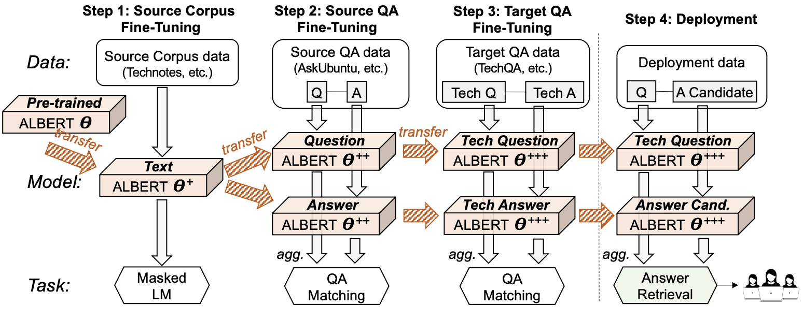

## TransTQA data and code

This repository contains the code package for the EMNLP'20 paper:

**[A Technical Question Answering System with Transfer Learning](https://www.aclweb.org/anthology/2020.emnlp-demos.13.pdf).** [Wenhao Yu](https://wyu97.github.io/) (ND), [Lingfei Wu](https://sites.google.com/a/email.wm.edu/teddy-lfwu/) (IBM), Yu Deng (IBM), Ruchi Mahindru (IBM), Qingkai Zeng (ND), Sinem Guven (IBM), [Meng Jiang](http://meng-jiang.com/) (ND).

- Our demonstration website is avaiable at http://159.89.9.22:5800/

- We also provide a video for the paper at https://vimeo.com/431118548

## System overall and Framework


> Figure: High level architecture of our proposed TransTQA system. First, the pre-trained ALBERT model is fine tuned with unstructured source technical corpus with masked language model (MLM) task, i.e., θ → θ+. Second, a siamese ALBERT takes fine tuned ALBERT and fine tunes with source technical QA, i.e., θ+ → θ++. Third, the siamese ALBERT further fine tunes with target QA, i.e., θ++ → θ+++. Our deployed system takes θ+++. Given a query, our system first calculates similarity scores between the query and each candidate answer, then ranks all scores from highest to lowest. Finally, the system returns top-3 ranked answers.
## Environment settings
A detailed dependencies list can be found in `requirements.txt` and can be installed by:
```
pip install -r requirements.txt
```
If you want to run with `fp16`, you need to install [Apex]( https://github.com/NVIDIA/apex.git)

## Run the code
For fine-tuning BERT masked language model on tech corpus (before you run the model, you have to first download the technical corpus from [here](https://drive.google.com/drive/folders/1WCwIIuEzhy695gkmkmIjhlDFxrKOBE0J?usp=sharing) and put it into `mlm/corpus` folder ):
```
./script/run_mlm.sh
```

For pre-training the model (we use [askubuntu](https://askubuntu.com/) for technical domain QA pre-training as default):
```
./script/run_pretrain.sh
```

For model transfer learning (we have two target datasets: [stackunix](https://unix.stackexchange.com/) and [techqa](https://leaderboard.techqa.us-east.containers.appdomain.cloud/) (ACL 2020)):
```
./script/run_transfer.sh
```

***Note*** that you should specify the path of pre-trained model and dataset.

## Citation
If you find this repository useful in your research, please consider to cite our paper:

```
@inproceedings{yu2020technical,
  title={A Technical Question Answering System with Transfer Learning},
  author={Yu, Wenhao and Wu, Lingfei and Deng, Yu and Mahindru, Ruchi and Zeng, Qingkai and Guven, Sinem and Jiang, Meng},
  booktitle={Proceedings of the 2020 Conference on Empirical Methods in Natural Language Processing (EMNLP)},
  year={2020}
}
```
